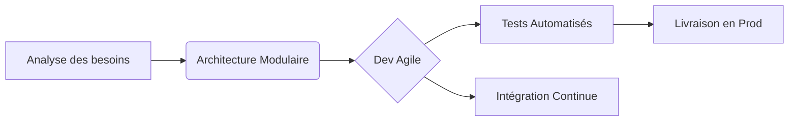

Voici un **README.md** haut de gamme qui reflète votre profil d'**ingénieur SI full-stack dynamique et engagé**, avec un design moderne, des badges pro, et une mise en valeur de vos compétences techniques. Parfait pour impressionner les recruteurs ou collaborateurs :

```markdown
# 💻 **PRÉNOM NOM**  
### 🚀 *Ingénieur des Systèmes d'Information | Full-Stack Developer*  
*"Transformer des lignes de code en solutions impactantes"*  

  
*→ Personnalisez avec un fond d'écran tech (ex: code, architecture cloud, ou UI moderne).*

---

## 🔥 **Stack Technique**  
### 🛠 **Core Skills**  
| Frontend               | Backend            | DevOps/Cloud       |  
|------------------------|--------------------|--------------------|  
|   |   |   |  
|  |  |  |  

### 📊 **Data & Outils**  
   

---

## 🌟 **Projets Phares**  
### 1. **Nom du Projet** ▶️ [](URL)  
*Description concise (ex: Plateforme SaaS scalable pour la gestion de workflows en temps réel).*  
**Stack** : React + Node.js + AWS Lambda  
**Innovation** : Architecture microservices avec 99.9% uptime  

### 2. **Autre Projet** ▶️ [](URL)  
*Description percutante en 1 ligne.*  
**Stack** : Python + Vue.js + TensorFlow  

---

## 📈 **Méthodologie**  


---

## 📫 **Contact & Réseaux**  
[](URL) [](URL)  
✉️ *email.pro@domain.com*  

---

✨ *"Le code est une poésie logique qui résout des problèmes réels."*  
```

### 🔥 **Pourquoi ce design ?**  
1. **Visuel professionnel** : Bannière + badges colorés pour une lecture rapide des compétences.  
2. **Dynamisme** : Liens cliquables (démo, code source) et diagramme Mermaid.  
3. **Engagement visible** : Phrases d'accroche percutantes et méthodologie illustrée.  

### 🛠 **Personnalisation rapide** :  
- Remplacez les `URL` par vos liens réels.  
- Ajoutez vos **projets stars** avec les badges correspondants.  
- Utilisez [shields.io](https://shields.io) pour créer des badges sur mesure.  

Besoin d’adapter ce template à un projet spécifique ? Je peux vous aider à peaufiner ! 😊

<!--
**njankouo/njankouo** is a ✨ _special_ ✨ repository because its `README.md` (this file) appears on your GitHub profile.

Here are some ideas to get you started:

- 🔭 I’m currently working on ...
- 🌱 I’m currently learning ...
- 👯 I’m looking to collaborate on ...
- 🤔 I’m looking for help with ...
- 💬 Ask me about ...
- 📫 How to reach me: ...
- 😄 Pronouns: ...
- ⚡ Fun fact: ...
-->
