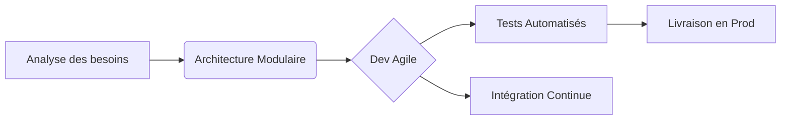

```markdown
# 💻NJANKOUO NDAM DAIROU
### 🚀 *Ingénieur des Systèmes d'Information | Full-Stack Developer*  
*"Transformer des lignes de code en solutions impactantes"*  

  

<!DOCTYPE html>
<html lang="fr">
<head>
    <meta charset="UTF-8">
    <meta name="viewport" content="width=device-width, initial-scale=1.0">
    <title>Njankouo Ndam Dairou | Ingénieur des SI Full-Stack</title>
    <script src="https://cdn.tailwindcss.com"></script>
    <link href="https://fonts.googleapis.com/css2?family=Inter:wght@300;400;500;600;700&display=swap" rel="stylesheet">
    <script>
        tailwind.config = {
            theme: {
                extend: {
                    colors: {
                        primary: '#3B82F6',
                        dark: '#1F2937',
                        light: '#F9FAFB',
                    },
                    fontFamily: {
                        sans: ['Inter', 'sans-serif'],
                    },
                }
            }
        }
    </script>
    <style type="text/css">
        .gradient-bg {
            background: linear-gradient(135deg, #3B82F6 0%, #1D4ED8 100%);
        }
        .project-card:hover {
            transform: translateY(-5px);
            box-shadow: 0 20px 25px -5px rgba(0, 0, 0, 0.1), 0 10px 10px -5px rgba(0, 0, 0, 0.04);
        }
    </style>
</head>
<body class="font-sans bg-light text-dark">
    <!-- Navigation -->
    <nav class="bg-white shadow-sm sticky top-0 z-50">
        <div class="max-w-7xl mx-auto px-4 sm:px-6 lg:px-8">
            <div class="flex justify-between h-16">
                <div class="flex items-center">
                    <span class="text-xl font-bold text-primary">NND</span>
                </div>
                <div class="hidden md:flex items-center space-x-8">
                    <a href="#about" class="text-gray-600 hover:text-primary transition">À Propos</a>
                    <a href="#skills" class="text-gray-600 hover:text-primary transition">Compétences</a>
                    <a href="#projects" class="text-gray-600 hover:text-primary transition">Projets</a>
                    <a href="#contact" class="text-gray-600 hover:text-primary transition">Contact</a>
                </div>
            </div>
        </div>
    </nav>

    <!-- Hero Section -->
    <header class="gradient-bg text-white py-20">
        <div class="max-w-7xl mx-auto px-4 sm:px-6 lg:px-8 text-center">
            <div class="flex justify-center mb-6">
                <div class="h-32 w-32 rounded-full bg-white bg-opacity-20 flex items-center justify-center">
                    <span class="text-4xl font-bold">N</span>
                </div>
            </div>
            <h1 class="text-4xl md:text-5xl font-bold mb-4">Njankouo Ndam Dairou</h1>
            <h2 class="text-2xl md:text-3xl font-semibold mb-6">Ingénieur des Systèmes d'Information | Full-Stack</h2>
            <p class="text-xl max-w-3xl mx-auto mb-8">Je conçois et développe des solutions logicielles performantes et évolutives pour répondre aux défis technologiques modernes.</p>
            <div class="flex justify-center space-x-4">
                <a href="#contact" class="bg-white text-primary px-6 py-3 rounded-md font-medium hover:bg-opacity-90 transition">Me Contacter</a>
                <a href="#projects" class="bg-transparent border-2 border-white text-white px-6 py-3 rounded-md font-medium hover:bg-white hover:bg-opacity-10 transition">Voir mes Projets</a>
            </div>
        </div>
    </header>

    <!-- About Section -->
    <section id="about" class="py-20 bg-white">
        <div class="max-w-7xl mx-auto px-4 sm:px-6 lg:px-8">
            <div class="text-center mb-12">
                <h2 class="text-3xl font-bold text-dark mb-4">À Propos de Moi</h2>
                <div class="w-20 h-1 bg-primary mx-auto"></div>
            </div>
            <div class="flex flex-col md:flex-row items-center">
                <div class="md:w-1/3 mb-8 md:mb-0 flex justify-center">
                    <div class="h-64 w-64 rounded-full bg-gray-200 overflow-hidden">
                        <!-- Remplacez par votre photo -->
                        <div class="h-full w-full bg-gray-300 flex items-center justify-center text-4xl font-bold">NND</div>
                    </div>
                </div>
                <div class="md:w-2/3 md:pl-12">
                    <h3 class="text-2xl font-semibold mb-4">Ingénieur des SI passionné par l'innovation</h3>
                    <p class="text-lg mb-4">Je m'appelle Njankouo Ndam Dairou, 27 ans, spécialisé dans le développement d'applications full-stack et l'architecture des systèmes d'information.</p>
                    <p class="text-lg mb-6">Mon approche combine rigueur technique, créativité et orientation résultats pour livrer des solutions qui répondent parfaitement aux besoins métiers.</p>
                    <div class="flex flex-wrap gap-4">
                        <div class="bg-gray-100 px-4 py-2 rounded-full">
                            <span class="text-sm font-medium">🎓 Diplômé en Génie Logiciel</span>
                        </div>
                        <div class="bg-gray-100 px-4 py-2 rounded-full">
                            <span class="text-sm font-medium">🚀 5+ ans d'expérience</span>
                        </div>
                        <div class="bg-gray-100 px-4 py-2 rounded-full">
                            <span class="text-sm font-medium">🌍 Disponible pour missions</span>
                        </div>
                    </div>
                </div>
            </div>
        </div>
    </section>

    <!-- Skills Section -->
    <section id="skills" class="py-20 bg-gray-50">
        <div class="max-w-7xl mx-auto px-4 sm:px-6 lg:px-8">
            <div class="text-center mb-12">
                <h2 class="text-3xl font-bold text-dark mb-4">Mes Compétences Techniques</h2>
                <div class="w-20 h-1 bg-primary mx-auto"></div>
            </div>
            
            <div class="grid grid-cols-1 md:grid-cols-3 gap-8">
                <!-- Frontend -->
                <div class="bg-white p-6 rounded-lg shadow-sm">
                    <div class="flex items-center mb-4">
                        <div class="bg-primary bg-opacity-10 p-2 rounded-md mr-4">
                            <svg xmlns="http://www.w3.org/2000/svg" class="h-6 w-6 text-primary" fill="none" viewBox="0 0 24 24" stroke="currentColor">
                                <path stroke-linecap="round" stroke-linejoin="round" stroke-width="2" d="M9.75 17L9 20l-1 1h8l-1-1-.75-3M3 13h18M5 17h14a2 2 0 002-2V5a2 2 0 00-2-2H5a2 2 0 00-2 2v10a2 2 0 002 2z" />
                            </svg>
                        </div>
                        <h3 class="text-xl font-semibold">Frontend</h3>
                    </div>
                    <div class="space-y-3">
                        <div>
                            <div class="flex justify-between mb-1">
                                <span class="text-sm font-medium">React.js</span>
                                <span class="text-sm">90%</span>
                            </div>
                            <div class="w-full bg-gray-200 rounded-full h-2">
                                <div class="bg-primary h-2 rounded-full" style="width: 90%"></div>
                            </div>
                        </div>
                        <div>
                            <div class="flex justify-between mb-1">
                                <span class="text-sm font-medium">Vue.js</span>
                                <span class="text-sm">85%</span>
                            </div>
                            <div class="w-full bg-gray-200 rounded-full h-2">
                                <div class="bg-primary h-2 rounded-full" style="width: 85%"></div>
                            </div>
                        </div>
                        <div>
                            <div class="flex justify-between mb-1">
                                <span class="text-sm font-medium">TypeScript</span>
                                <span class="text-sm">80%</span>
                            </div>
                            <div class="w-full bg-gray-200 rounded-full h-2">
                                <div class="bg-primary h-2 rounded-full" style="width: 80%"></div>
                            </div>
                        </div>
                    </div>
                </div>
                
                <!-- Backend -->
                <div class="bg-white p-6 rounded-lg shadow-sm">
                    <div class="flex items-center mb-4">
                        <div class="bg-primary bg-opacity-10 p-2 rounded-md mr-4">
                            <svg xmlns="http://www.w3.org/2000/svg" class="h-6 w-6 text-primary" fill="none" viewBox="0 0 24 24" stroke="currentColor">
                                <path stroke-linecap="round" stroke-linejoin="round" stroke-width="2" d="M5 12h14M5 12a2 2 0 01-2-2V6a2 2 0 012-2h14a2 2 0 012 2v4a2 2 0 01-2 2M5 12a2 2 0 00-2 2v4a2 2 0 002 2h14a2 2 0 002-2v-4a2 2 0 00-2-2m-2-4h.01M17 16h.01" />
                            </svg>
                        </div>
                        <h3 class="text-xl font-semibold">Backend</h3>
                    </div>
                    <div class="space-y-3">
                        <div>
                            <div class="flex justify-between mb-1">
                                <span class="text-sm font-medium">Node.js</span>
                                <span class="text-sm">92%</span>
                            </div>
                            <div class="w-full bg-gray-200 rounded-full h-2">
                                <div class="bg-primary h-2 rounded-full" style="width: 92%"></div>
                            </div>
                        </div>
                        <div>
                            <div class="flex justify-between mb-1">
                                <span class="text-sm font-medium">Python/Django</span>
                                <span class="text-sm">88%</span>
                            </div>
                            <div class="w-full bg-gray-200 rounded-full h-2">
                                <div class="bg-primary h-2 rounded-full" style="width: 88%"></div>
                            </div>
                        </div>
                        <div>
                            <div class="flex justify-between mb-1">
                                <span class="text-sm font-medium">Java/Spring</span>
                                <span class="text-sm">75%</span>
                            </div>
                            <div class="w-full bg-gray-200 rounded-full h-2">
                                <div class="bg-primary h-2 rounded-full" style="width: 75%"></div>
                            </div>
                        </div>
                    </div>
                </div>
                
                <!-- DevOps -->
                <div class="bg-white p-6 rounded-lg shadow-sm">
                    <div class="flex items-center mb-4">
                        <div class="bg-primary bg-opacity-10 p-2 rounded-md mr-4">
                            <svg xmlns="http://www.w3.org/2000/svg" class="h-6 w-6 text-primary" fill="none" viewBox="0 0 24 24" stroke="currentColor">
                                <path stroke-linecap="round" stroke-linejoin="round" stroke-width="2" d="M10 20l4-16m4 4l4 4-4 4M6 16l-4-4 4-4" />
                            </svg>
                        </div>
                        <h3 class="text-xl font-semibold">DevOps & Cloud</h3>
                    </div>
                    <div class="space-y-3">
                        <div>
                            <div class="flex justify-between mb-1">
                                <span class="text-sm font-medium">Docker/K8s</span>
                                <span class="text-sm">85%</span>
                            </div>
                            <div class="w-full bg-gray-200 rounded-full h-2">
                                <div class="bg-primary h-2 rounded-full" style="width: 85%"></div>
                            </div>
                        </div>
                        <div>
                            <div class="flex justify-between mb-1">
                                <span class="text-sm font-medium">AWS</span>
                                <span class="text-sm">80%</span>
                            </div>
                            <div class="w-full bg-gray-200 rounded-full h-2">
                                <div class="bg-primary h-2 rounded-full" style="width: 80%"></div>
                            </div>
                        </div>
                        <div>
                            <div class="flex justify-between mb-1">
                                <span class="text-sm font-medium">CI/CD</span>
                                <span class="text-sm">78%</span>
                            </div>
                            <div class="w-full bg-gray-200 rounded-full h-2">
                                <div class="bg-primary h-2 rounded-full" style="width: 78%"></div>
                            </div>
                        </div>
                    </div>
                </div>
            </div>
            
            <!-- Badges Technologies -->
            <div class="mt-12">
                <h3 class="text-xl font-semibold text-center mb-6">Technologies Maîtrisées</h3>
                <div class="flex flex-wrap justify-center gap-3">
                    <span class="bg-gray-100 px-4 py-2 rounded-full text-sm font-medium">React</span>
                    <span class="bg-gray-100 px-4 py-2 rounded-full text-sm font-medium">Vue.js</span>
                    <span class="bg-gray-100 px-4 py-2 rounded-full text-sm font-medium">TypeScript</span>
                    <span class="bg-gray-100 px-4 py-2 rounded-full text-sm font-medium">Node.js</span>
                    <span class="bg-gray-100 px-4 py-2 rounded-full text-sm font-medium">Python</span>
                    <span class="bg-gray-100 px-4 py-2 rounded-full text-sm font-medium">Django</span>
                    <span class="bg-gray-100 px-4 py-2 rounded-full text-sm font-medium">Docker</span>
                    <span class="bg-gray-100 px-4 py-2 rounded-full text-sm font-medium">Kubernetes</span>
                    <span class="bg-gray-100 px-4 py-2 rounded-full text-sm font-medium">AWS</span>
                    <span class="bg-gray-100 px-4 py-2 rounded-full text-sm font-medium">Terraform</span>
                    <span class="bg-gray-100 px-4 py-2 rounded-full text-sm font-medium">PostgreSQL</span>
                    <span class="bg-gray-100 px-4 py-2 rounded-full text-sm font-medium">MongoDB</span>
                </div>
            </div>
        </div>
    </section>

    <!-- Projects Section -->
    <section id="projects" class="py-20 bg-white">
        <div class="max-w-7xl mx-auto px-4 sm:px-6 lg:px-8">
            <div class="text-center mb-12">
                <h2 class="text-3xl font-bold text-dark mb-4">Mes Projets Récents</h2>
                <div class="w-20 h-1 bg-primary mx-auto"></div>
                <p class="text-lg text-gray-600 mt-4 max-w-2xl mx-auto">Découvrez une sélection de mes réalisations techniques les plus significatives.</p>
            </div>
            
            <div class="grid grid-cols-1 md:grid-cols-2 lg:grid-cols-3 gap-8">
                <!-- Projet 1 -->
                <div class="project-card bg-white rounded-lg overflow-hidden shadow-md transition duration-300">
                    <div class="h-48 bg-gray-200 flex items-center justify-center">
                        <span class="text-gray-500">Image du Projet</span>
                    </div>
                    <div class="p-6">
                        <h3 class="text-xl font-bold mb-2">Plateforme SaaS de Gestion</h3>
                        <p class="text-gray-600 mb-4">Solution complète de gestion d'entreprise avec tableau de bord analytique en temps réel.</p>
                        <div class="flex flex-wrap gap-2 mb-4">
                            <span class="bg-blue-100 text-blue-800 text-xs px-2 py-1 rounded">React</span>
                            <span class="bg-green-100 text-green-800 text-xs px-2 py-1 rounded">Node.js</span>
                            <span class="bg-yellow-100 text-yellow-800 text-xs px-2 py-1 rounded">MongoDB</span>
                        </div>
                        <div class="flex space-x-3">
                            <a href="#" class="text-primary font-medium hover:underline">Code Source</a>
                            <a href="#" class="text-primary font-medium hover:underline">Live Demo</a>
                        </div>
                    </div>
                </div>
                
                <!-- Projet 2 -->
                <div class="project-card bg-white rounded-lg overflow-hidden shadow-md transition duration-300">
                    <div class="h-48 bg-gray-200 flex items-center justify-center">
                        <span class="text-gray-500">Image du Projet</span>
                    </div>
                    <div class="p-6">
                        <h3 class="text-xl font-bold mb-2">Application Mobile de Santé</h3>
                        <p class="text-gray-600 mb-4">Suivi médical intelligent avec notifications et intégration API santé.</p>
                        <div class="flex flex-wrap gap-2 mb-4">
                            <span class="bg-purple-100 text-purple-800 text-xs px-2 py-1 rounded">Flutter</span>
                            <span class="bg-blue-100 text-blue-800 text-xs px-2 py-1 rounded">Firebase</span>
                            <span class="bg-red-100 text-red-800 text-xs px-2 py-1 rounded">TensorFlow Lite</span>
                        </div>
                        <div class="flex space-x-3">
                            <a href="#" class="text-primary font-medium hover:underline">Code Source</a>
                            <a href="#" class="text-primary font-medium hover:underline">Play Store</a>
                        </div>
                    </div>
                </div>
                
                <!-- Projet 3 -->
                <div class="project-card bg-white rounded-lg overflow-hidden shadow-md transition duration-300">
                    <div class="h-48 bg-gray-200 flex items-center justify-center">
                        <span class="text-gray-500">Image du Projet</span>
                    </div>
                    <div class="p-6">
                        <h3 class="text-xl font-bold mb-2">Système de Recommandation IA</h3>
                        <p class="text-gray-600 mb-4">Algorithme de recommandation personnalisée pour plateforme e-commerce.</p>
                        <div class="flex flex-wrap gap-2 mb-4">
                            <span class="bg-orange-100 text-orange-800 text-xs px-2 py-1 rounded">Python</span>
                            <span class="bg-pink-100 text-pink-800 text-xs px-2 py-1 rounded">Scikit-learn</span>
                            <span class="bg-indigo-100 text-indigo-800 text-xs px-2 py-1 rounded">FastAPI</span>
                        </div>
                        <div class="flex space-x-3">
                            <a href="#" class="text-primary font-medium hover:underline">Code Source</a>
                            <a href="#" class="text-primary font-medium hover:underline">Documentation</a>
                        </div>
                    </div>
                </div>
            </div>
            
            <div class="text-center mt-12">
                <a href="#" class="inline-flex items-center px-6 py-3 border border-transparent text-base font-medium rounded-md text-white bg-primary hover:bg-blue-700 transition">
                    Voir Plus de Projets
                    <svg xmlns="http://www.w3.org/2000/svg" class="ml-2 h-5 w-5" viewBox="0 0 20 20" fill="currentColor">
                        <path fill-rule="evenodd" d="M10.293 5.293a1 1 0 011.414 0l4 4a1 1 0 010 1.414l-4 4a1 1 0 01-1.414-1.414L12.586 11H5a1 1 0 110-2h7.586l-2.293-2.293a1 1 0 010-1.414z" clip-rule="evenodd" />
                    </svg>
                </a>
            </div>
        </div>
    </section>

    <!-- Contact Section -->
    <section id="contact" class="py-20 gradient-bg text-white">
        <div class="max-w-7xl mx-auto px-4 sm:px-6 lg:px-8">
            <div class="text-center mb-12">
                <h2 class="text-3xl font-bold mb-4">Travaillons Ensemble</h2>
                <div class="w-20 h-1 bg-white bg-opacity-50 mx-auto"></div>
                <p class="text-xl mt-4 max-w-2xl mx-auto">Vous avez un projet ambitieux ? Discutons-en autour d'un café virtuel !</p>
            </div>
            
            <div class="max-w-3xl mx-auto">
                <form class="space-y-6">
                    <div class="grid grid-cols-1 md:grid-cols-2 gap-6">
                        <div>
                            <label for="name" class="block text-sm font-medium">Nom Complet</label>
                            <input type="text" id="name" name="name" class="mt-1 block w-full bg-white bg-opacity-10 border border-white border-opacity-20 rounded-md py-3 px-4 focus:outline-none focus:ring-2 focus:ring-white focus:border-transparent" placeholder="Votre nom">
                        </div>
                        <div>
                            <label for="email" class="block text-sm font-medium">Email</label>
                            <input type="email" id="email" name="email" class="mt-1 block w-full bg-white bg-opacity-10 border border-white border-opacity-20 rounded-md py-3 px-4 focus:outline-none focus:ring-2 focus:ring-white focus:border-transparent" placeholder="email@exemple.com">
                        </div>
                    </div>
                    <div>
                        <label for="subject" class="block text-sm font-medium">Sujet</label>
                        <input type="text" id="subject" name="subject" class="mt-1 block w-full bg-white bg-opacity-10 border border-white border-opacity-20 rounded-md py-3 px-4 focus:outline-none focus:ring-2 focus:ring-white focus:border-transparent" placeholder="De quoi souhaitez-vous discuter ?">
                    </div>
                    <div>
                        <label for="message" class="block text-sm font-medium">Message</label>
                        <textarea id="message" name="message" rows="4" class="mt-1 block w-full bg-white bg-opacity-10 border border-white border-opacity-20 rounded-md py-3 px-4 focus:outline-none focus:ring-2 focus:ring-white focus:border-transparent" placeholder="Décrivez votre projet ou demande..."></textarea>
                    </div>
                    <div>
                        <button type="submit" class="w-full flex justify-center items-center px-6 py-3 border border-transparent text-base font-medium rounded-md text-primary bg-white hover:bg-opacity-90 transition focus:outline-none focus:ring-2 focus:ring-offset-2 focus:ring-white">
                            Envoyer le Message
                            <svg xmlns="http://www.w3.org/2000/svg" class="ml-2 h-5 w-5" viewBox="0 0 20 20" fill="currentColor">
                                <path d="M10.894 2.553a1 1 0 00-1.788 0l-7 14a1 1 0 001.169 1.409l5-1.429A1 1 0 009 15.571V11a1 1 0 112 0v4.571a1 1 0 00.725.962l5 1.428a1 1 0 001.17-1.408l-7-14z" />
                            </svg>
                        </button>
                    </div>
                </form>
                
                <div class="mt-16 grid grid-cols-1 md:grid-cols-3 gap-8 text-center">
                    <div>
                        <div class="bg-white bg-opacity-10 p-4 rounded-full inline-block mb-4">
                            <svg xmlns="http://www.w3.org/2000/svg" class="h-6 w-6" fill="none" viewBox="0 0 24 24" stroke="currentColor">
                                <path stroke-linecap="round" stroke-linejoin="round" stroke-width="2" d="M3 8l7.89 5.26a2 2 0 002.22 0L21 8M5 19h14a2 2 0 002-2V7a2 2 0 00-2-2H5a2 2 0 00-2 2v10a2 2 0 002 2z" />
                            </svg>
                        </div>
                        <h3 class="text-lg font-medium mb-1">Email</h3>
                        <p class="opacity-80">contact@ndairou.com</p>
                    </div>
                    <div>
                        <div class="bg-white bg-opacity-10 p-4 rounded-full inline-block mb-4">
                            <svg xmlns="http://www.w3.org/2000/svg" class="h-6 w-6" fill="none" viewBox="0 0 24 24" stroke="currentColor">
                                <path stroke-linecap="round" stroke-linejoin="round" stroke-width="2" d="M3 5a2 2 0 012-2h3.28a1 1 0 01.948.684l1.498 4.493a1 1 0 01-.502 1.21l-2.257 1.13a11.042 11.042 0 005.516 5.516l1.13-2.257a1 1 0 011.21-.502l4.493 1.498a1 1 0 01.684.949V19a2 2 0 01-2 2h-1C9.716 21 3 14.284 3 6V5z" />
                            </svg>
                        </div>
                        <h3 class="text-lg font-medium mb-1">Téléphone</h3>
                        <p class="opacity-80">+237 XXX XXX XXX</p>
                    </div>
                    <div>
                        <div class="bg-white bg-opacity-10 p-4 rounded-full inline-block mb-4">
                            <svg xmlns="http://www.w3.org/2000/svg" class="h-6 w-6" fill="none" viewBox="0 0 24 24" stroke="currentColor">
                                <path stroke-linecap="round" stroke-linejoin="round" stroke-width="2" d="M17.657 16.657L13.414 20.9a1.998 1.998 0 01-2.827 0l-4.244-4.243a8 8 0 1111.314 0z" />
                                <path stroke-linecap="round" stroke-linejoin="round" stroke-width="2" d="M15 11a3 3 0 11-6 0 3 3 0 016 0z" />
                            </svg>
                        </div>
                        <h3 class="text-lg font-medium mb-1">Localisation</h3>
                        <p class="opacity-80">Yaoundé, Cameroun</p>
                    </div>
                </div>
            </div>
        </div>
    </section>

    <!-- Footer -->
    <footer class="bg-dark text-white py-8">
        <div class="max-w-7xl mx-auto px-4 sm:px-6 lg:px-8">
            <div class="flex flex-col md:flex-row justify-between items-center">
                <div class="mb-4 md:mb-0">
                    <span class="text-xl font-bold">Njankouo Ndam Dairou</span>
                    <p class="text-gray-400 mt-1">Ingénieur des Systèmes d'Information Full-Stack</p>
                </div>
                <div class="flex space-x-6">
                    <a href="#" class="text-gray-400 hover:text-white transition">
                        <svg xmlns="http://www.w3.org/2000/svg" class="h-6 w-6" fill="currentColor" viewBox="0 0 24 24">
                            <path d="M12 0c-6.626 0-12 5.373-12 12 0 5.302 3.438 9.8 8.207 11.387.599.111.793-.261.793-.577v-2.234c-3.338.726-4.033-1.416-4.033-1.416-.546-1.387-1.333-1.756-1.333-1.756-1.089-.745.083-.729.083-.729 1.205.084 1.839 1.237 1.839 1.237 1.07 1.834 2.807 1.304 3.492.997.107-.775.418-1.305.762-1.604-2.665-.305-5.467-1.334-5.467-5.931 0-1.311.469-2.381 1.236-3.221-.124-.303-.535-1.524.117-3.176 0 0 1.008-.322 3.301 1.23.957-.266 1.983-.399 3.003-.404 1.02.005 2.047.138 3.006.404 2.291-1.552 3.297-1.23 3.297-1.23.653 1.653.242 2.874.118 3.176.77.84 1.235 1.911 1.235 3.221 0 4.609-2.807 5.624-5.479 5.921.43.372.823 1.102.823 2.222v3.293c0 .319.192.694.801.576 4.765-1.589 8.199-6.086 8.199-11.386 0-6.627-5.373-12-12-12z"/>
                        </svg>
                    </a>
                    <a href="#" class="text-gray-400 hover:text-white transition">
                        <svg xmlns="http://www.w3.org/2000/svg" class="h-6 w-6" fill="currentColor" viewBox="0 0 24 24">
                            <path d="M19 0h-14c-2.761 0-5 2.239-5 5v14c0 2.761 2.239 5 5 5h14c2.762 0 5-2.239 5-5v-14c0-2.761-2.238-5-5-5zm-11 19h-3v-11h3v11zm-1.5-12.268c-.966 0-1.75-.79-1.75-1.764s.784-1.764 1.75-1.764 1.75.79 1.75 1.764-.783 1.764-1.75 1.764zm13.5 12.268h-3v-5.604c0-3.368-4-3.113-4 0v5.604h-3v-11h3v1.765c1.396-2.586 7-2.777 7 2.476v6.759z"/>
                        </svg>
                    </a>
                    <a href="#" class="text-gray-400 hover:text-white transition">
                        <svg xmlns="http://www.w3.org/2000/svg" class="h-6 w-6" fill="currentColor" viewBox="0 0 24 24">
                            <path d="M24 4.557c-.883.392-1.832.656-2.828.775 1.017-.609 1.798-1.574 2.165-2.724-.951.564-2.005.974-3.127 1.195-.897-.957-2.178-1.555-3.594-1.555-3.179 0-5.515 2.966-4.797 6.045-4.091-.205-7.719-2.165-10.148-5.144-1.29 2.213-.669 5.108 1.523 6.574-.806-.026-1.566-.247-2.229-.616-.054 2.281 1.581 4.415 3.949 4.89-.693.188-1.452.232-2.224.084.626 1.956 2.444 3.379 4.6 3.419-2.07 1.623-4.678 2.348-7.29 2.04 2.179 1.397 4.768 2.212 7.548 2.212 9.142 0 14.307-7.721 13.995-14.646.962-.695 1.797-1.562 2.457-2.549z"/>
                        </svg>
                    </a>
                </div>
            </div>
            <div class="mt-8 pt-8 border-t border-gray-800 text-center text-gray-400 text-sm">
                <p>© 2023 Njankouo Ndam Dairou. Tous droits réservés.</p>
            </div>
        </div>
    </footer>
</body>
</html>

---

## 🔥 **Stack Technique**  
### 🛠 **Core Skills**  
| Frontend               | Backend            | DevOps/Cloud       |  
|------------------------|--------------------|--------------------|  
|   |   |   |  
|  |  |  |  

### 📊 **Data & Outils**  
   

---

## 🌟 **Projets Phares**  
### 1. **Nom du Projet** ▶️ [](URL)  
*Description concise (ex: Plateforme SaaS scalable pour la gestion de workflows en temps réel).*  
**Stack** : React + Node.js + AWS Lambda  
**Innovation** : Architecture microservices avec 99.9% uptime  

### 2. **Autre Projet** ▶️ [](URL)  
*Description percutante en 1 ligne.*  
**Stack** : Python + Vue.js + TensorFlow  

---

## 📈 **Méthodologie**  


---

## 📫 **Contact & Réseaux**  
[](URL) [](URL)  
✉️ *email.pro@domain.com*  

---

✨ *"Le code est une poésie logique qui résout des problèmes réels."*  
```

### 🔥 **Pourquoi ce design ?**  
1. **Visuel professionnel** : Bannière + badges colorés pour une lecture rapide des compétences.  
2. **Dynamisme** : Liens cliquables (démo, code source) et diagramme Mermaid.  
3. **Engagement visible** : Phrases d'accroche percutantes et méthodologie illustrée.  

### 🛠 **Personnalisation rapide** :  
- Remplacez les `URL` par vos liens réels.  
- Ajoutez vos **projets stars** avec les badges correspondants.  
- Utilisez [shields.io](https://shields.io) pour créer des badges sur mesure.  

Besoin d’adapter ce template à un projet spécifique ? Je peux vous aider à peaufiner ! 😊

<!--
**njankouo/njankouo** is a ✨ _special_ ✨ repository because its `README.md` (this file) appears on your GitHub profile.

Here are some ideas to get you started:

- 🔭 I’m currently working on ...
- 🌱 I’m currently learning ...
- 👯 I’m looking to collaborate on ...
- 🤔 I’m looking for help with ...
- 💬 Ask me about ...
- 📫 How to reach me: ...
- 😄 Pronouns: ...
- ⚡ Fun fact: ...
-->
